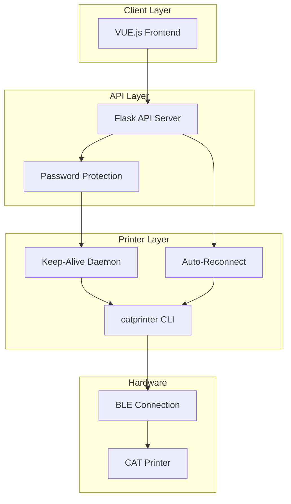

# CAT Printer Web Interface - Implementation Plan

## Overview
Enhance the go-catprinter with a full-featured web interface, Docker support, and production-ready enhancements.

## Architecture



## Implementation Steps

### 1. Flask API Server (app.py)
- [ ] Create Flask app with routes
- [ ] Implement keep-alive system (ping every 2.5 min)
- [ ] Add auto-reconnect logic
- [ ] Implement PDF conversion
- [ ] Add password protection middleware

### 2. Web Frontend (templates/index.html)
- [ ] Enhance Vue.js interface with better aesthetics
- [ ] Add PDF upload tab
- [ ] Improve UI/UX with TailwindCSS

### 3. Docker Support
- [ ] Create Dockerfile
- [ ] Create docker-compose.yml
- [ ] Add Bluetooth dependencies

### 4. GitHub Repository
- [ ] Initialize git repository
- [ ] Add proper attribution to original repo
- [ ] Create public repository

### 5. Documentation
- [ ] README with setup instructions
- [ ] Environment variables documentation
- [ ] API documentation

## Environment Variables
```
CAT_PRINTER_MAC=A1:49:35:A0:C8:79
PRINTER_WORKDIR=/app/catprinter
FLASK_PORT=5000
ADMIN_PASSWORD=changeme
ENABLE_AUTH=true
```

## Dependencies
- Flask
- Flask-HTTPAuth
- Pillow
- pdf2image or PyMuPDF
- python-dotenv

## Original Repository Attribution
- Original: https://git.boxo.cc/massivebox/go-catprinter
- License: MIT